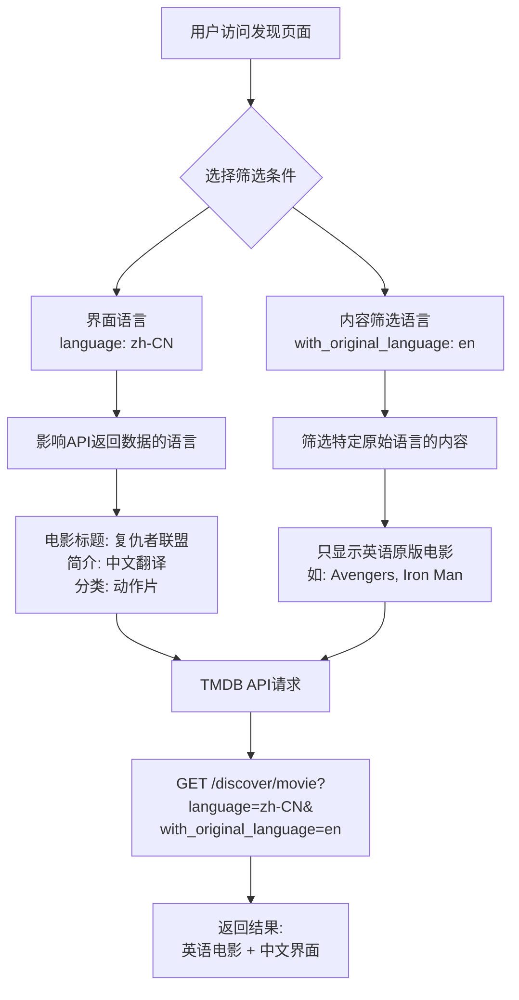

# TMDB API 语言配置详解

## 概述

在使用 TMDB API 时，涉及到两个不同的"语言"概念，很容易混淆。本文档详细解释这两种语言的区别、用途和配置方法。

## 🔄 两种语言概念

### 1. 界面语言 (Interface Language)

**参数名**: `language`
**作用**: 控制 TMDB API 返回数据的显示语言
**影响内容**: 电影标题翻译、简介翻译、分类名称等

```typescript
// 示例：请求中文界面数据
{
  language: 'zh-CN' // 返回中文翻译的标题和简介
}
```

### 2. 内容筛选语言 (Content Filter Language)

**参数名**: `with_original_language`
**作用**: 筛选特定原始语言的电影/电视剧
**影响内容**: 决定显示哪些电影（按原始制作语言筛选）

```typescript
// 示例：筛选英语原版电影
{
  with_original_language: 'en' // 只显示英语原版电影
}
```

## 📊 对比分析

| 特征         | **界面语言**              | **内容筛选语言**            |
| ------------ | ------------------------- | --------------------------- |
| **参数名**   | `language`                | `with_original_language`    |
| **格式**     | `zh-CN`, `en-US`, `ja-JP` | `zh`, `en`, `ja`            |
| **作用范围** | API 返回数据的语言        | 筛选特定语言的内容          |
| **用户控制** | 全局设置（当前固定）      | 筛选器中可选择              |
| **代码位置** | `composables/useHttp.ts`  | `pages/discover/[type].vue` |

## 🎯 实际使用示例

### 场景：用户想看英语电影，但界面显示中文

```typescript
// API 请求参数
const params = {
  language: 'zh-CN', // 界面语言：中文
  with_original_language: 'en', // 内容筛选：英语电影
}

// 请求 URL
// GET /discover/movie?language=zh-CN&with_original_language=en
```

**结果**:

- ✅ 显示英语原版电影（如《Avengers》）
- ✅ 电影标题显示为中文翻译："复仇者联盟"
- ✅ 电影简介也是中文翻译
- ✅ 分类显示为"动作片"而不是"Action"

## 🔧 项目中的实现

### 1. 界面语言配置

```typescript
// composables/useHttp.ts
export const useHttp = <T>({ url, method, params, opts }) => {
  const options = (opts as UseFetchOptions<ResOptions<T>>) || {}
  options.params = {
    language: 'zh-CN', // 全局默认界面语言
    ...params,
  }
  // ...
}
```

### 2. 内容筛选语言配置

```typescript
// constants/languages.ts
export const CONTENT_LANGUAGE_OPTIONS = [
  { value: '', label: '所有语言' },
  { value: 'zh', label: '中文' },
  { value: 'en', label: '英语' },
  { value: 'ja', label: '日语' },
  { value: 'ko', label: '韩语' },
  // ... 更多语言
]
```

```vue
<!-- pages/discover/[type].vue -->
<template>
  <select v-model="filters.with_original_language">
    <option
      v-for="option in CONTENT_LANGUAGE_OPTIONS"
      :key="option.value"
      :value="option.value"
    >
      {{ option.label }}
    </option>
  </select>
</template>
```

## 🌐 TMDB 官方语言支持

TMDB API 使用 **ISO 639-1** 语言代码标准，支持数百种语言。

### 获取完整语言列表

```typescript
// api/detail.ts
export const getLanguagesConfiguration = () => {
  return useHttp<
    Array<{
      iso_639_1: string
      english_name: string
      name: string
    }>
  >({
    url: '/configuration/languages',
    method: 'GET',
  })
}
```

### 常用语言代码

#### 界面语言格式 (language)

```typescript
'zh-CN' // 中文（简体）
'zh-TW' // 中文（繁体）
'en-US' // 英语（美国）
'ja-JP' // 日语
'ko-KR' // 韩语
'fr-FR' // 法语
'de-DE' // 德语
'es-ES' // 西班牙语
'pt-BR' // 葡萄牙语（巴西）
'ru-RU' // 俄语
```

#### 内容筛选格式 (with_original_language)

```typescript
'zh' // 中文
'en' // 英语
'ja' // 日语
'ko' // 韩语
'fr' // 法语
'de' // 德语
'es' // 西班牙语
'pt' // 葡萄牙语
'ru' // 俄语
```

## 🔄 数据流程图



## 💡 最佳实践

### 1. 界面语言设置

```typescript
// 推荐：根据用户偏好设置界面语言
const userLanguage = getUserLanguagePreference() // 'zh-CN', 'en-US', etc.

// composables/useHttp.ts
options.params = {
  language: userLanguage || 'zh-CN', // 支持用户自定义
  ...params,
}
```

### 2. 内容筛选语言

```typescript
// 推荐：提供丰富的语言选择
export const CONTENT_LANGUAGE_OPTIONS = [
  { value: '', label: '所有语言' },
  { value: 'zh', label: '中文' },
  { value: 'en', label: '英语' },
  { value: 'ja', label: '日语' },
  { value: 'ko', label: '韩语' },
  { value: 'fr', label: '法语' },
  { value: 'de', label: '德语' },
  { value: 'es', label: '西班牙语' },
  { value: 'pt', label: '葡萄牙语' },
  { value: 'ru', label: '俄语' },
  { value: 'it', label: '意大利语' },
  { value: 'ar', label: '阿拉伯语' },
  { value: 'hi', label: '印地语' },
  { value: 'th', label: '泰语' },
]
```

### 3. 动态语言加载

```typescript
// 推荐：从 TMDB API 动态获取语言列表
const { data: supportedLanguages } = await getLanguagesConfiguration()

// 转换为应用所需格式
const languageOptions = supportedLanguages.map(lang => ({
  value: lang.iso_639_1,
  label: lang.name || lang.english_name,
}))
```

## 🚨 常见误区

### ❌ 错误理解

```typescript
// 错误：认为两个参数是一样的
{
  language: 'en',              // 这会导致界面变成英文
  with_original_language: 'en' // 这才是筛选英语电影
}
```

### ✅ 正确理解

```typescript
// 正确：明确区分两个概念
{
  language: 'zh-CN',           // 界面显示中文
  with_original_language: 'en' // 筛选英语电影
}
// 结果：英语电影，中文界面
```

## 📝 开发注意事项

1. **参数格式不同**：
   - `language` 使用 `zh-CN` 格式（语言-地区）
   - `with_original_language` 使用 `zh` 格式（仅语言）

2. **作用范围不同**：
   - `language` 影响所有返回数据的语言
   - `with_original_language` 只影响内容筛选

3. **用户体验**：
   - 界面语言应该跟随用户系统语言或用户设置
   - 内容筛选语言应该让用户自由选择

4. **缓存策略**：
   - 不同界面语言的数据应该分别缓存
   - 内容筛选的结果也应该分别缓存

## 🔗 相关文档

- [TMDB API 官方文档 - Languages](https://developer.themoviedb.org/docs/languages)
- [项目中的语言常量定义](../constants/languages.ts)
- [发现页面实现](../pages/discover/[type].vue)
- [HTTP 请求封装](../composables/useHttp.ts)
